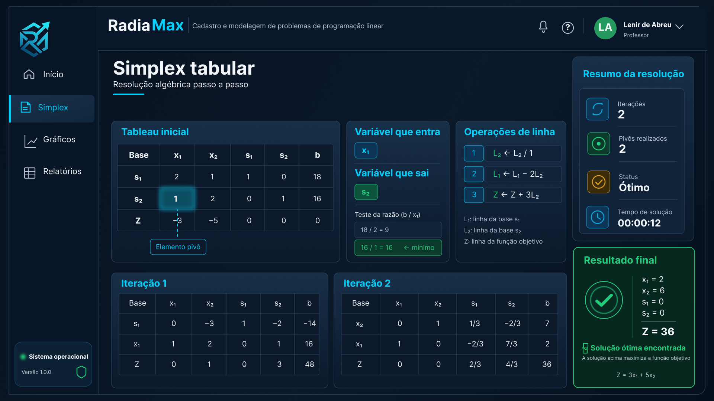
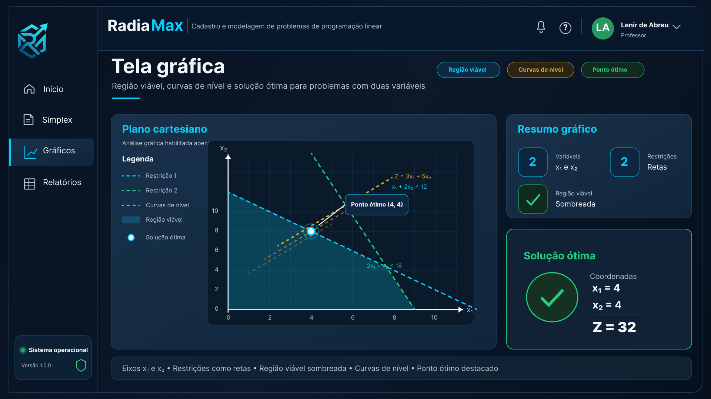

# RadiaMax

<div align="center">
  

  <p><b>RadiaMax</b> é um sistema desktop em <b>Python</b> para cadastro, modelagem, visualização e resolução de problemas de <b>Pesquisa Operacional</b>, com foco no <b>método Simplex (forma tabular)</b>.</p>

  <p>
    
    
    
    
  </p>
</div>

---

## Visão geral

**RadiaMax** é um sistema desktop desenvolvido em **Python** para cadastro, modelagem, visualização e resolução de problemas de **Pesquisa Operacional**, com foco no uso do **método Simplex em sua forma tabular**.

O projeto foi desenvolvido como trabalho acadêmico com o objetivo de implementar um algoritmo capaz de resolver problemas com características semelhantes ao **problema radioterápico**, incluindo restrições, função objetivo, análise gráfica, solução tabular e recursos de apoio à interpretação da solução ótima.

---

## Demonstração (UI)

### Tela Simplex (tabular)



### Tela Gráficos



---

## Objetivo do sistema

O objetivo principal do RadiaMax é permitir que o usuário cadastre um problema de programação linear, visualize sua estrutura matemática e acompanhe a resolução por meio do método Simplex.

O sistema busca unir:

* modelagem matemática;
* método Simplex tabular;
* visualização gráfica da região viável;
* identificação da solução ótima;
* análise de possíveis soluções inteiras;
* interface visual moderna e intuitiva.

---

## Contexto acadêmico

O sistema foi desenvolvido considerando os requisitos propostos para o trabalho:

> O algoritmo deve ser capaz de solucionar um problema com as mesmas características do problema radioterápico utilizando o método Simplex na forma tabular.

Além disso, o projeto considera os seguintes pontos solicitados:

* resolução algébrica pelo método Simplex tabular;
* identificação da variável que entra;
* identificação da variável que sai;
* teste da razão mínima;
* execução das operações de pivoteamento;
* exibição das iterações do tableau;
* plotagem da região de viabilidade;
* plotagem das curvas de nível;
* identificação da solução ótima graficamente;
* identificação da solução ótima algebricamente;
* possibilidade de análise de solução inteira;
* estrutura preparada para identificação de solução múltipla;
* interface gráfica com boa experiência de uso.

O algoritmo **TORA** foi utilizado como referência conceitual para a organização das etapas de resolução e apresentação tabular.

---

## Tecnologias utilizadas

* **Python 3.10+**
* **PySide6 (Qt)**
* **Qt / QPainter**
* Estrutura modular por páginas (`pages/`)
* Interface desktop com tema escuro
* Componentes visuais customizados

A escolha do **PySide6** permite criar uma interface desktop moderna, com maior controle visual do que bibliotecas mais simples como Tkinter.

---

## Estrutura do projeto

```txt
RadiaMax/
├── main.py
├── pages/
│   ├── __init__.py
│   ├── problems.py
│   ├── graphs.py
│   └── simplex.py
├── public/
│   ├── logo.png
│   ├── backgroundCard.png
│   ├── tela_graficos.png
│   └── tela_simplex.png
├── requirements.txt
└── README.md
```

---

## Telas implementadas

### 1. Tela inicial

A tela inicial apresenta o painel principal do sistema, com acesso rápido às principais funcionalidades:

* novo problema;
* carregar exemplo;
* tutorial;
* histórico;
* acesso ao módulo Simplex;
* acesso à análise gráfica;
* acesso aos relatórios.

### 2. Cadastro do problema

Tela destinada à modelagem matemática do problema.

Permite representar:

* tipo de problema: maximização ou minimização;
* função objetivo;
* variáveis de decisão;
* restrições;
* condição de não negatividade;
* indicação de solução inteira.

Exemplo de modelo:

```txt
max Z = 3x₁ + 2x₂ + x₃

2x₁ + x₂ + 0x₃ ≤ 8
x₁ + 2x₂ + x₃ ≥ 6
x₁ + x₂ + x₃ = 10

x ≥ 0
```

### 3. Tela gráfica

A tela gráfica tem como objetivo representar visualmente problemas com duas variáveis.

Ela apresenta:

* plano cartesiano;
* restrições como retas;
* região viável sombreada;
* curvas de nível da função objetivo;
* ponto ótimo destacado;
* resumo gráfico da solução.

### 4. Tela Simplex tabular

A tela Simplex apresenta a resolução algébrica passo a passo.

Ela exibe:

* tableau inicial;
* variável que entra;
* variável que sai;
* elemento pivô;
* teste da razão mínima;
* operações de linha;
* iterações do tableau;
* resultado final.

---

## Funcionamento esperado do algoritmo Simplex

O algoritmo deve seguir as seguintes etapas:

1. Receber a função objetivo e as restrições.
2. Converter o modelo para a forma padrão.
3. Inserir variáveis de folga, excesso ou artificiais quando necessário.
4. Montar o tableau inicial.
5. Escolher a variável que entra na base.
6. Escolher a variável que sai da base pelo teste da razão mínima.
7. Identificar o elemento pivô.
8. Normalizar a linha pivô.
9. Aplicar operações de linha para zerar a coluna pivô.
10. Repetir o processo até atingir a condição de otimalidade.
11. Exibir a solução ótima e o valor final de Z.

Critério adotado para maximização:

* entra na base a variável com coeficiente mais negativo na linha Z;
* sai da base a variável obtida pelo menor quociente positivo no teste da razão;
* a solução é ótima quando não há coeficientes negativos na linha Z.

---

## Recursos previstos

* cadastro completo de modelos de programação linear;
* resolução Simplex tabular;
* análise gráfica para problemas com duas variáveis;
* detecção de solução ótima;
* detecção de solução inviável;
* detecção de solução ilimitada;
* detecção de solução múltipla;
* proposta de solução inteira;
* exportação de resultados;
* geração de relatórios;
* histórico de resoluções.

---

## Status do projeto

O RadiaMax encontra-se em desenvolvimento.

Até o momento, foram desenvolvidas as principais telas de interface:

* tela inicial;
* cadastro do problema;
* análise gráfica;
* Simplex tabular.

As próximas etapas envolvem a integração definitiva entre o formulário de cadastro, o algoritmo Simplex e os módulos gráficos.

---

## Como executar o projeto

### 1. Criar e ativar um ambiente virtual

Windows:

```bash
python -m venv .venv
.venv\Scripts\activate
```

Linux / macOS:

```bash
python -m venv .venv
source .venv/bin/activate
```

### 2. Instalar dependências

```bash
pip install -r requirements.txt
```

### 3. Executar

```bash
python main.py
```

---

## Exemplo de problema utilizado

```txt
Maximizar:

Z = 3x₁ + 5x₂

Sujeito a:

x₁ + 2x₂ ≤ 12
2x₁ + x₂ ≤ 18
x₁ ≥ 0
x₂ ≥ 0
```

Solução esperada:

```txt
x₁ = 4
x₂ = 4
Z = 32
```

---

## Diferenciais do projeto

* navegação por módulos;
* visualização didática do método Simplex;
* separação entre modelagem, gráfico e resolução tabular;
* estrutura preparada para expansão;
* foco em usabilidade;
* apresentação visual adequada para avaliação acadêmica.

---

## Equipe

Projeto desenvolvido em equipe para a disciplina de Programação Linear / Pesquisa Operacional, no curso de Engenharia de Sistemas.

---

## Observação

Este sistema possui finalidade acadêmica e está em fase de desenvolvimento. A proposta é demonstrar a aplicação prática do método Simplex com uma interface visual clara, permitindo ao usuário compreender tanto a formulação matemática quanto o processo de resolução.
